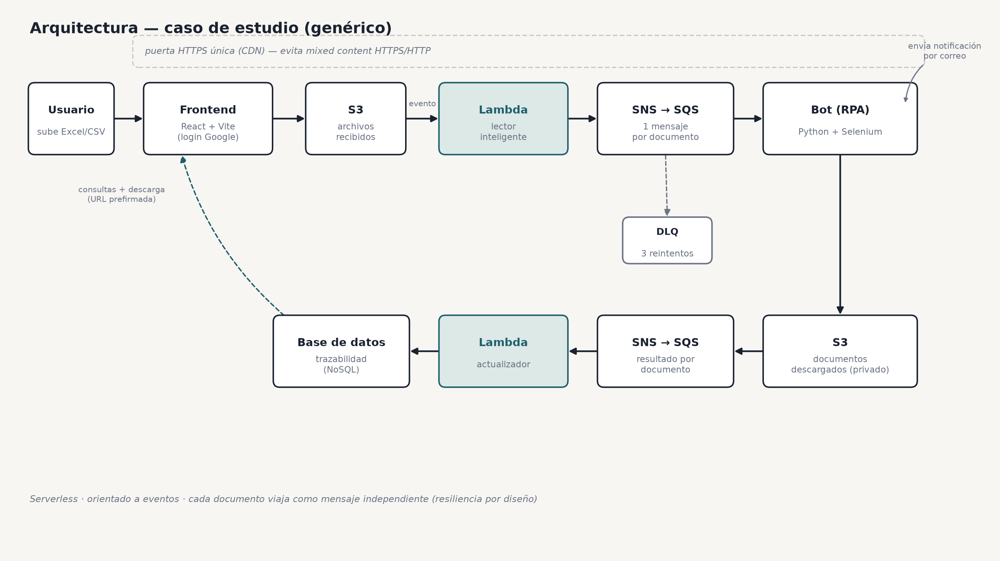

# RPA de descarga de documentos en la nube (AWS) — caso de estudio

> Representación **anonimizada** de un sistema real que diseñé y construí, en equipo con otros dos
> practicantes, durante mi práctica profesional. **No contiene código propietario ni datos de
> cliente**: es un resumen técnico + muestras de código propias que ilustran las técnicas empleadas.

## El problema
Una tarea 100% manual y repetitiva: entrar a un portal web, buscar cada documento por número de
identificación, descargarlo y enviarlo por correo — miles de veces al mes, para un aliado
estratégico del sector telecomunicaciones. El proceso manual alcanzaba un tope físico de 300-400
documentos por día por persona, generando cuellos de botella y riesgo de incumplir los acuerdos de
servicio. El objetivo: **automatizarlo** de forma escalable, resiliente y trazable.

## La solución
Un sistema **serverless y orientado a eventos** en AWS con 4 componentes:

| Componente | Tecnología | Rol |
|---|---|---|
| Frontend | React + Vite | Interfaz web (subir Excel, consultar, descargar). Login con Google. |
| Bot (RPA) | Python · FastAPI · Selenium | Descarga cada documento del portal, lo guarda y lo envía. |
| Backend serverless | 9 funciones AWS Lambda (Python) | Orquestación: lectura, encolado, consumo, actualización, consultas. |
| Carril de archivos grandes | Spring Boot (Java) | Procesa los Excel que superan el límite de las Lambdas. |

**AWS:** Lambda · S3 · DynamoDB · SNS/SQS (con DLQ) · EC2 · CloudFront · API Gateway · IAM · SSM/KMS.

### Diagrama

*(el flujo: Frontend → S3 → Lambda lectora → SNS/SQS → Lambda consumidor → Bot Selenium → S3/DynamoDB)*

### Video demo
[Video del sistema en funcionamiento](https://drive.google.com/file/d/1Dqm-rsLSi3hXDgm_5ltTSSuSIFmGhJjf/view?usp=drivesdk) —
grabado durante las pruebas del proyecto, con el flujo completo de principio a fin.

## Resultados
- Escalé el procesamiento de **300-400 documentos/día** (proceso manual) a **hasta 4.000
  documentos/día**, una mejora de más del **80% en tiempo de ejecución**, mediante una arquitectura
  multihilo con colas de trabajo.
- Proceso manual → **automático y desatendido**, con trazabilidad completa: por cada documento se
  registra paso, usuario, ID de proceso y resultado.
- Interfaz de consulta con descarga individual y ZIP masivo.
- Sistema entregado, documentado y desplegado en producción; además empaqueté una versión de
  escritorio (.exe) como solución puente para necesidades urgentes del negocio mientras se completaba
  la migración a la nube.

## Decisiones técnicas de las que estoy orgulloso
- **Resiliencia por diseño:** cada documento viaja como un mensaje independiente en una cola (SQS).
  Si uno falla, los demás continúan; hay reintentos automáticos y una cola de errores (DLQ).
- **Lector inteligente de Excel/CSV:** detecta columnas por **nombre de encabezado** (con sinónimos
  y coincidencia difusa), no por posición → tolera archivos con columnas reordenadas o mal escritas.
  Muestra de código: [`ejemplos/lector_inteligente.py`](ejemplos/lector_inteligente.py) *(ejecutable)*.
- **Seguridad:** buckets privados, descargas por URL prefirmada, login validado con token de Google,
  credenciales cifradas (SSM/KMS), **cero secretos en el código**.
- **Redes/navegador:** resolví el bloqueo de *mixed content* (web HTTPS llamando a un backend HTTP)
  usando **CloudFront** como puerta única (HTTPS de cara al navegador, HTTP interno hacia el backend).
- **Portabilidad:** configuración 100% por variables de entorno (12-factor) → desplegable en
  cualquier cuenta AWS sin tocar código.

## Muestras de código
- [`ejemplos/lector_inteligente.py`](ejemplos/lector_inteligente.py) — detector de columnas por
  encabezado con sinónimos + coincidencia difusa. Autocontenido y ejecutable (`python lector_inteligente.py`).

## Stack
`React` · `Vite` · `Python` · `FastAPI` · `Selenium` · `boto3` · `Java` · `Spring Boot` ·
`AWS Lambda` · `S3` · `DynamoDB` · `SNS` · `SQS` · `EC2` · `CloudFront` · `API Gateway`

---

> **Nota:** el sistema completo se desarrolló para una empresa y vive en su repositorio privado.
> Este repositorio es una **muestra anonimizada** con fines de portafolio.

## Contacto
Brayan Camilo Fonseca Gaona — [brayancamilofonsecagaona@gmail.com](mailto:brayancamilofonsecagaona@gmail.com) · [GitHub](https://github.com/BrayitanDev)
